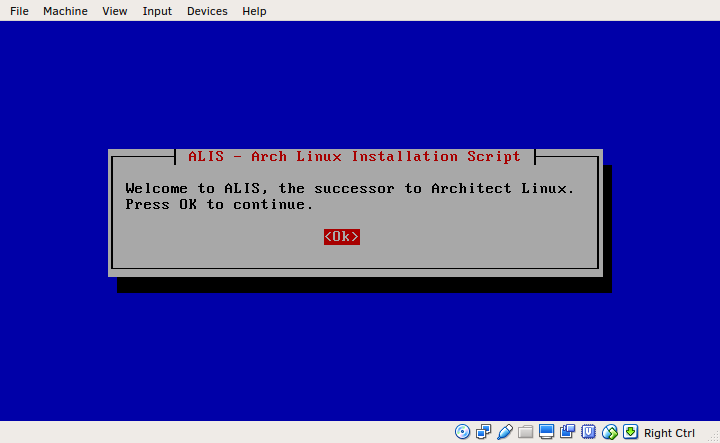
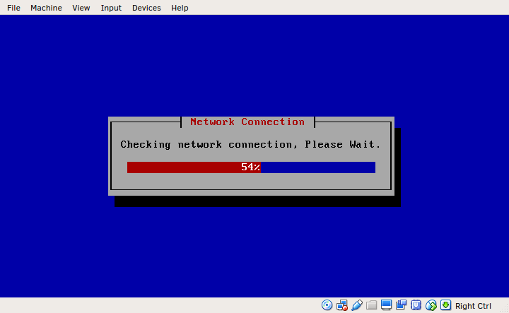
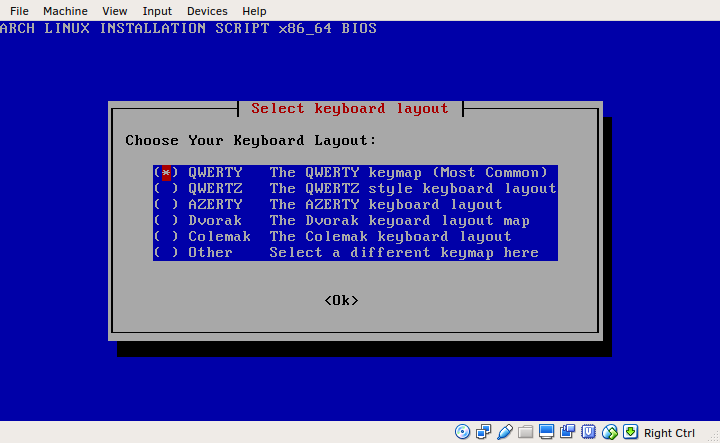
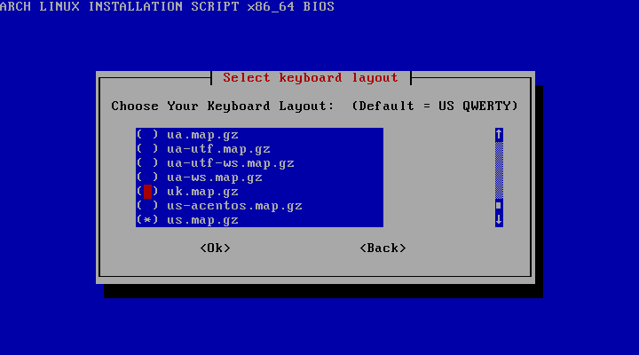
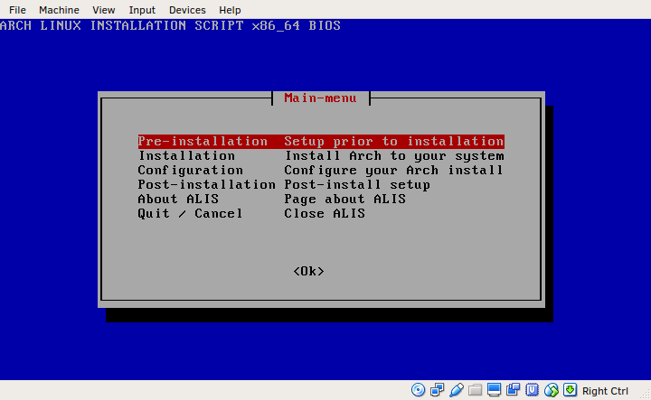

# ALIS - Arch Linux Installation Script

The successor of Architect Linux (currently still in development)

**NOTE:**
**It is recommended that you do not use this program at this current time. The reasoning behind this is that currently it may result in major problems with partitions or wipe existing data, etc. This is because ALIS is currently still being developed and is still not at the experimental stage of development.**

This is ALIS - Arch Linux Installation Script. ALIS has been built from the ground up, using the Perl scripting language and Bash. The aim of ALIS is to help guide beginner Arch Linux users through the Arch installation process. ALIS has many advanced configuration options, these make ALIS well suited for use by both advanced users and beginners. ALIS will create a base plain and simple Arch system, with zero bloat.

The inspiration for this project was Architect Linux, which sadly ceased development on 2016-04-05. ALIS is it's (hopefully successful) successor.

This is the ``README.md`` file for [ALIS](https://gitlab.com/axvr/alis). Created by Alex Vear [axvr](https://gitlab.com/axvr).

This project is licenced under the [GPL3 Copyleft Licence](https://gitlab.com/axvr/alis/blob/master/LICENCE).

If you find any bugs or errors, please feel free to submit an issue as i cannot test ALIS on every possible system for problems. I would in the future like to add multi-language support to ALIS, help would be greatly appreciated, especially since Google Translate is not entirely accurate a lot of the time. For more information on contributing to ALIS see this document: [https://gitlab.com/axvr/alis/blob/master/CONTRIBUTING.md](https://gitlab.com/axvr/alis/blob/master/CONTRIBUTING.md).

---

## Screenshots

---

## How to use ALIS

In order to use ALIS, you will need an Arch Linux live CD, and the machine you wish to install Arch onto.

### Compatible System Architecture and Boot Modes

Please ensure that your system meets these system types:

#### Architecture

* x86_64
* i686 - Depreciated

#### Boot Mode

* BIOS
* UEFI

#### To be Supported

* Apple Machines

### Make an Arch Linux live Disk/CD

Follow these instructions from the Arch Wiki on how to make and verify your own Arch live disk: [https://wiki.archlinux.org/index.php/Category:Getting_and_installing_Arch](https://wiki.archlinux.org/index.php/Category:Getting_and_installing_Arch). This will be reqired for ALIS to work correctly. Once this has been done then insert the medium into the machine you wish to install Arch Linux to, then boot up the system, to that disk.

Alternatively, if you are looking to test out Arch or just to experiment with it, there is also the option of using a Virtual Machine (A computer running on a computer). To do this follow these instructions and download the Arch ISO from here: [https://wiki.archlinux.org/index.php/Category:Getting_and_installing_Arch](https://wiki.archlinux.org/index.php/Category:Getting_and_installing_Arch), and optionally (recommended) verify your download. Follow these instructions to setup a virtual machine in your current OS using Oracle's VirtualBox: [https://www.virtualbox.org/manual/ch01.html](https://www.virtualbox.org/manual/ch01.html).

### Setup and Start ALIS

**NOTE:**
**ALIS and Arch Linux both require a stable internet connection, this is best done using an Ethernet connection directly into the machine (virtual machines have internet by default if the host machine has an internet connection of some kind).**

First ALIS will need to be downloaded to the live Arch distro. The ALIS download contains all of the files needed for ALIS to run without any problems. This can be done by typing **exactly** this command.

``wget https://gitlab.com/axvr/alis/repository/archive.tar.gz``

Extract the downloaded gzip (tar.gz) file.

``tar -zxvf archive.tar.gz``

You will then need to Move into the new ALIS directory (the ``...`` will be randomly generated so use tab auto-complete to automatically complete the directory name).

``cd alis-master-.../``

Start ALIS using

``perl start.pl --start``

Follow the on screen instructions to install Arch Linux.

### All ALIS Options

#### start.pl

* The ALIS start command: ``--start``. This command must be given for ALIS to start, some other commands may follow (e.g. ``--force``).
* Force ALIS to skip the network check ``--force``. Should be given after the ``--start`` command (**Not recommended under any circumstance**).
* Display this document: ``--help`` or ``-h``. (May be replaced with a simplified help menu stating options and how to view this file using: ``less README.md``).
* Display ALIS version information: ``--version`` or ``-v``. (May be replaced with an independent version file).
* To display usage information add no or invalid optons to ``start.pl`` (this includes ``--start``).

#### main-menu.pl

``main-menu.pl`` currently takes in 3 options as ``main-menu.pl $ARGV[0] $ARGV[1] $ARGV[2]`` these are as follows:

* ``$ARGV[0]`` => System hardware version (e.g. ``x86_64``).
* ``$ARGV[1]`` => System boot mode (e.g. ``BIOS``).
* ``$ARGV[2]`` => Selected keymap (e.g. ``de-latin1``).

The ``main-menu.pl`` argument system may be advanced in the future to be similar to that on ``start.pl``.

**More ALIS options will be added in the future**

### Other Useful Information

* To view this entire file with the ability to scroll, run this command: ``less README.me``.
* There is currently an i686 phase out being undertaken in Arch Linux (in a nutshell: 32 bit Arch Linux will become fully unsupported in November 2017). The most common way to upgrade your system to 64 bit is to ensure that it has at least 4GB of RAM and that 64 bit is supported by the system BIOS. For info on the phase out see this page: [https://www.archlinux.org/news/phasing-out-i686-support/](https://www.archlinux.org/news/phasing-out-i686-support/).
