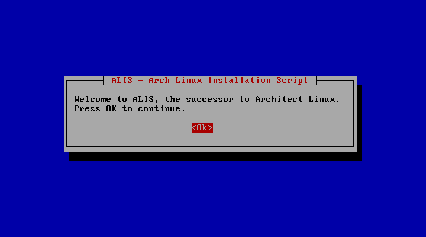
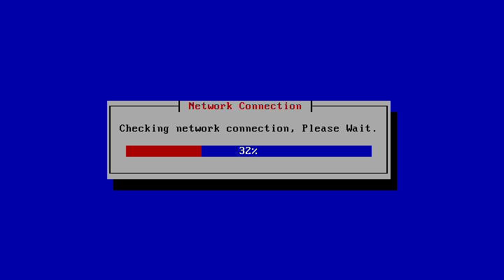

# Archaic - The Primitive Arch Linux Installer

<!-- Badges made using https://shields.io/ -->

This is Archaic - The Primitive Arch Linux Installer. Archaic has been built from the ground up (including a new and custom Newt Whiptail control framework), using the Perl scripting language and Bash. Archaic contains many advanced configuration options, this makes Archaic very well suited for use by both advanced users, and beginners of Arch Linux. Archaic will create a base plain and simple Arch system, with zero bloat.

The inspiration for this project was Architect Linux, which sadly ceased development on 2016-04-05. Archaic is it's (hopefully successful) successor.

This is the `README.md` file for [Archaic](https://github.com/axvr/archaic). Created by [Alex Vear - axvr](https://github.com/axvr).

This project is licenced under the [GNU GPL v3.0](https://github.com/axvr/archaic/blob/master/LICENCE).

If you find any bugs or errors, please feel free to submit an issue as I cannot test Archaic on every possible system for problems. I would like help with the translations for Archaic, if you can the help would be greatly appreciated, especially since Google Translate is not entirely accurate most of the time. For more information on contributing to Archaic see the [contributing document](https://github.com/axvr/archaic/blob/master/docs/CONTRIBUTING.md) and ensure that you read and agree to the [Code of Conduct](https://github.com/axvr/archaic/blob/master/docs/CODE_OF_CONDUCT.md).

---

## Screenshots

<!-- TODO create new screenshots (and place in codedump to shrink download size)-->

---

## How to use Archaic

In order to use Archaic, you will need an Arch Linux live CD or ISO, and the machine you wish to install Arch onto.

### Compatible System Architecture and Boot Modes

Please ensure that your system meets these system types:

#### Architecture

* x86_64

#### Boot Mode

* BIOS
* UEFI

#### Still to be Supported

* PowerPC

### Make an Arch Linux live Disk/CD

Follow the instructions from the Arch Wiki on how to [make and verify your own Arch live disk](https://wiki.archlinux.org/index.php/Category:Getting_and_installing_Arch). This will be required for Archaic to work correctly. Once this has been done then insert the medium into the machine you wish to install Arch Linux to, then boot up the system, to that disk.

Alternatively, if you are looking to test out Arch or just to experiment with it, there is also the option of using a Virtual Machine (A computer running on a computer). To do this follow these instructions and download the Arch ISO from [here](https://wiki.archlinux.org/index.php/Category:Getting_and_installing_Arch), and optionally (recommended) verify your download. Follow these [instructions](https://www.virtualbox.org/manual/ch01.html) to setup a virtual machine in your current OS using Oracle's VirtualBox.

### Setup and Start Archaic

**NOTE: Archaic and Arch Linux both require a stable internet connection, this is best done using an ethernet connection directly into the machine (virtual machines have internet by default if the host machine has an internet connection).**

First Archaic will need to be downloaded to the live Arch distro. The download contains all of the files needed for Archaic to run without any problems. This can be done by typing **exactly** this command (replace the `<version>` with the [latest version number](https://github.com/axvr/archaic/releases)).

`wget https://github.com/axvr/archaic/archive/v<version>.tar.gz`

Extract the downloaded gzip (tar.gz) file (the `<version>` will be version number from before).

`tar -zxvf v<version>.tar.gz`

You will then need to Move into the new Archaic directory (the `<version>` will be version number from before).

`cd archaic-v<version>/`

Start Archaic using

`./archaic`

Follow the on screen instructions to install Arch Linux.

### All Archaic Options

* Set language for Archaic to use: `--language` or `-l` followed by language code (see below for codes).
* Display help message: `--help` or `-h`.
* Display usage information: `--usage` or `-u`.
* Display Archaic version information: `--version` or `-v`.
* Select a theme for Archaic: `--theme` or `-t` followed by a theme name (see below).

### Archaic Language Options (language codes)

* `en` => English
* `fr` => French
* `es` => Spanish

### Archaic Theme Options (theme names)

* `default`   => Default theme
* `cyberpunk` => Cyberpunk style theme

---

## To do

### Core components

* [x] Multi-language support
* [x] Language selection and changing
* [x] Log file functioning (and reduce chance of data corruption)
* [x] Create a new help menu
* [x] Create a usage menu
* [x] Split sections into individual modules
* [x] Create Whiptail module
* [x] Extend Whiptail module to use smart parameters
* [x] Complete a basic version of the Whiptail module
* [x] Design and create a new menu page using the new modules
* [ ] Split Whiptail control framework from Archaic

### Documentation

* [x] Include all current commands in the README.md file
* [x] Comment code and increase readability
* [x] Expand Documentation to include contribution page
* [x] Change project Licence from the MIT Licence to the GNU GPL v3.0
* [ ] Create a "Hacking Archaic" document
* [ ] Update contribution document
* [ ] Update code of conduct

### Start up

* [x] Check hardware configuration of device
* [x] Create base version of the program
* [x] Check the network connection
* [x] Sync the time with NTP servers
* [ ] Replace old keyboard layout selector (maybe move sections)

### Pre Install Section

* [x] Display partition map
* [x] Allow device/partition wiping securely
* [x] Allow manual partitioning
* [ ] Create auto partition script
* [ ] Format disks

### Installation Section

* [ ] (PENDING)

### System Configuration Section

* [ ] (PENDING)

### Post Installation Section

* [ ] (PENDING)
